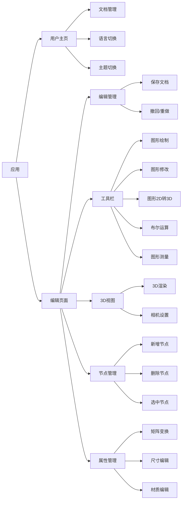

# 1 主要功能



# 2 运行截图

基础图形绘制：


合并图形：


材质编辑：


扫略：


长度测量 & 角度测量：


用户主页：


# 3 代码目录结构

```
light3D/
├── cpp/              			# OpenCASCADE源码
│   └── src/      				# OpenCASCADE源码文件
│   └── CMakeLists      		# 编译文件
├── packages/           		# 项目所有子包
│   ├── light/          		# 应用对象、文档对象、命令注册等
│   ├── light-builder/        	# 构建的配置文件、构建脚本
│   ├── light-controls/        	# 用户交互控件
│   ├── light-core/       		# 通用的数据结构定义、基础的工具函数、全局的常量定义
│   ├── light-geo/        		# 几何图形相关
│   ├── light-storage/       	# 数据存储
│   ├── light-ui/    			# 用户界面
│   ├── light-three/  			# 对three.js的二次封装
│   └── light-vis/      		# 3D交互事件处理
│   └── light-wasm/      		# 封装与 WebAssembly 交互的接口，方便在项目中使用 Wasm 模块
│   └── light-web/      		# 入口文件相关
│   └── global.d.ts      		# TypeScript类型声明
├── public/             		# 公共资源
│   └── fonts/               	# 字体
│   └── favicon.svg             # logo
│   └── iconfont.js           	# 所有图标的svg
│   └── index.css           	# 公共样式文件
│   └── index.html           	# 项目的入口HTML文件
├── scripts/            		# 脚本
│   └── common.mjs         		# 自动化脚本工具函数
│   ├── release.mjs      		# 子包版本统一管理
│   └── setup_wasm_deps.mjs     # C++ 依赖库自动化构建脚本
├── .env                		# 环境配置
├── package.json				# 所有子包共同的依赖 & 项目启动脚本
├── tsconfig.json				# TypeScript配置文件
├── rspack.config.js			# Rspack 配置文件
```

# 4 启动命令

```
npm install
npm run dev
```

